# Know Thyself - Architecture Diagrams

Comprehensive Mermaid diagrams for understanding the Electron application architecture.

---

## Quick Reference for Claude Code

### What This Is

A desktop Electron application for AI-guided self-reflection. Users converse with Claude AI, and the system extracts psychological insights (values, challenges, Maslow signals) storing them in dual databases for pattern recognition.

**Current State**: Phase 1 skeleton complete. Basic chat + status display working. Extraction and profile computation not yet implemented.

### Tech Stack

| Layer | Technology | Purpose |
|-------|------------|---------|
| Desktop | Electron 33 | Cross-platform app shell |
| UI | React 18 + TypeScript | Renderer process |
| Bundler | Vite 6 | Dev server + production build |
| AI Chat | Anthropic SDK | Claude Haiku 4.5 |
| Embeddings | ONNX Runtime + voyage-4-nano | Local 2048-dim vectors |
| Relational DB | better-sqlite3 | Structured data (WAL mode) |
| Vector DB | LanceDB | Semantic similarity search |
| Testing | Playwright | E2E tests for Electron |

### Key Files

| File | Purpose | When to Modify |
|------|---------|----------------|
| `src/main/index.ts` | Electron entry, lifecycle, init orchestration | Adding initialization steps |
| `src/main/ipc.ts` | IPC handlers (main ↔ renderer) | Adding new API endpoints |
| `src/main/claude.ts` | Anthropic SDK wrapper | Changing AI behavior/model |
| `src/main/embeddings.ts` | ONNX model loading + inference | Changing embedding model |
| `src/main/db/sqlite.ts` | SQLite schema + queries | Adding tables/queries |
| `src/main/db/lancedb.ts` | Vector store operations | Adding vector collections |
| `src/preload/index.ts` | Context bridge (exposes `window.api`) | Exposing new IPC to renderer |
| `src/renderer/App.tsx` | Main React component | UI changes |
| `src/shared/types.ts` | TypeScript interfaces | Adding/changing data types |

### Development Commands

```bash
make dev          # Start dev servers (Vite + Electron + watch)
make build        # Production build + package
make typecheck    # TypeScript checking
make lint         # ESLint
make test         # Playwright tests
make check        # All quality gates
```

### IPC Channel Reference

| Channel | Direction | Pattern | Purpose |
|---------|-----------|---------|---------|
| `chat:send` | R→M | invoke/handle | Single response chat |
| `chat:stream` | R→M | send/on | Start streaming chat |
| `chat:chunk` | M→R | reply | Stream text chunk |
| `chat:done` | M→R | reply | Stream complete |
| `chat:error` | M→R | reply | Stream error |
| `profile:get` | R→M | invoke/handle | Get profile summary |
| `embeddings:embed` | R→M | invoke/handle | Generate embedding |
| `embeddings:ready` | R→M | invoke/handle | Check model status |
| `app:status` | R→M | invoke/handle | Get init status |

### Adding New Features

**New IPC endpoint:**
1. Add types to `src/shared/types.ts`
2. Add handler in `src/main/ipc.ts`
3. Expose in `src/preload/index.ts` (update ElectronAPI interface inline)
4. Call from `src/renderer/*.tsx`

**New database table:**
1. Add schema in `src/main/db/sqlite.ts` (in `initSQLite()`)
2. Add types to `src/shared/types.ts`
3. Add query functions in sqlite.ts
4. Expose via IPC if needed by renderer

**New React component:**
1. Create in `src/renderer/components/`
2. Import in `App.tsx`
3. Use `window.api.*` for backend calls

### Critical Constraints

| Constraint | Reason | Impact |
|------------|--------|--------|
| ESM in main process | `"type": "module"` in package.json | Use `.js` extensions in imports |
| CommonJS in preload | Electron requirement | Separate tsconfig, package.json written post-compile |
| Relative imports only | Path aliases break in main process | No `@/` style imports in main |
| Context isolation | Security | Renderer cannot access Node.js directly |
| Sandbox disabled | better-sqlite3 native module | Required for native bindings |
| Single test worker | Electron constraint | Tests run sequentially |

### Environment Variables

| Variable | Required | Purpose |
|----------|----------|---------|
| `ANTHROPIC_API_KEY` | Yes | Claude API authentication |
| `NODE_ENV` | Auto | development/test/production |

**Security**: API key loaded via dotenv in `src/main/index.ts`. Never log or expose.

### Data Locations (Runtime)

| Data | Location | Notes |
|------|----------|-------|
| SQLite DB | `{userData}/know-thyself.db` | Structured data |
| LanceDB | `{userData}/lancedb/` | Vector store |
| ONNX Model | `{userData}/models/voyage-4-nano/` | Downloaded on first run |

`{userData}` = `app.getPath('userData')` (OS-specific AppData/Library)

### Common Patterns

**Streaming IPC** (for real-time responses):
```typescript
// Main: use on() + event.reply()
ipcMain.on('chat:stream', async (event, message) => {
  for await (const chunk of streamMessage(message)) {
    event.reply('chat:chunk', { chunk, done: false });
  }
  event.reply('chat:done');
});

// Renderer: register listeners before calling
window.api.chat.onChunk((chunk) => setResponse(prev => prev + chunk));
window.api.chat.stream(message);
```

**Request-Response IPC** (for simple queries):
```typescript
// Main: use handle()
ipcMain.handle('profile:get', async () => { return data; });

// Renderer: use invoke()
const profile = await window.api.profile.get();
```

**Non-blocking initialization**:
```typescript
// Embeddings load in background, UI polls status
initEmbeddings().catch(err => { initError = err.message; });
// Renderer polls app:status every 2s to update UI
```

---

## 1. Architecture Overview (C4 Model)

### Level 1: System Context

Shows the system's place in the world - who uses it and what external systems it depends on.

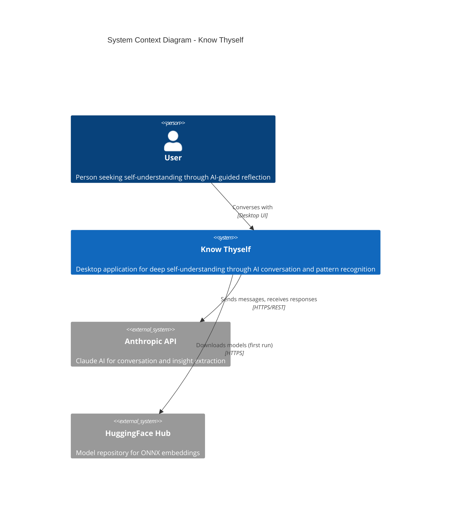

### Level 2: Container Diagram

Shows the high-level technical building blocks and how they interact.

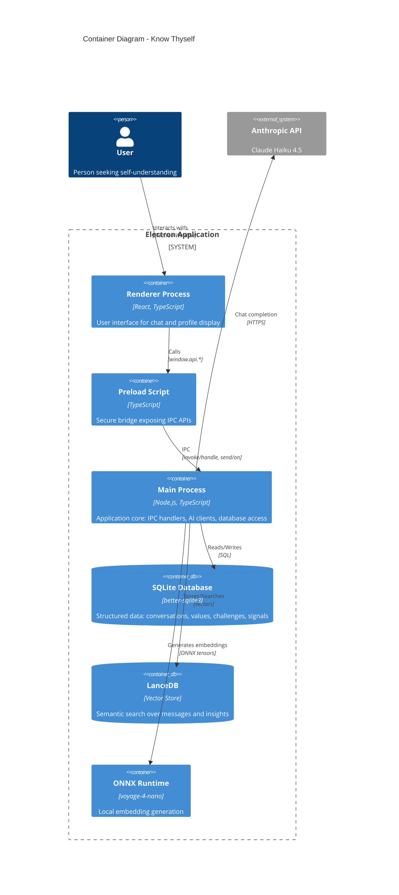

### Level 3: Component Diagram (Main Process)

Shows the internal components of the main process.

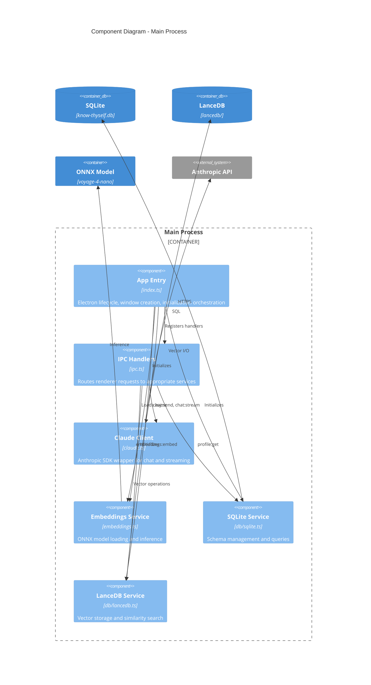

---

## 2. Dependency Graph

### Module Dependencies

Shows how source modules depend on each other, revealing layers and coupling.

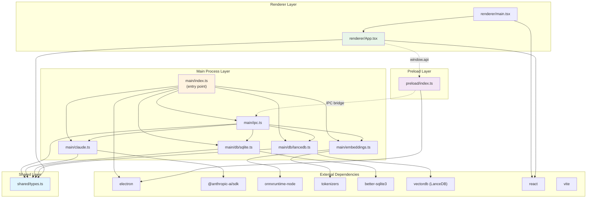

### Package Dependency Layers

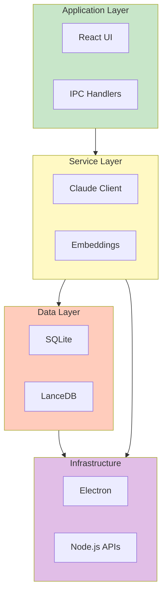

---

## 3. Data Flow Diagrams

### Chat Message Flow

Traces a user message from input to response display.

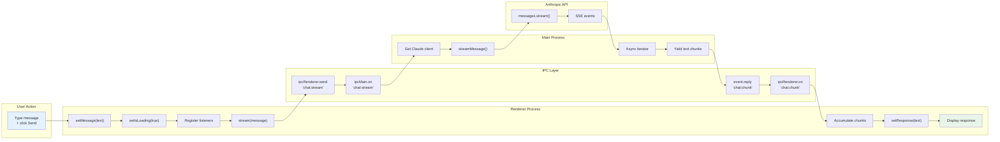

### Embedding Generation Flow

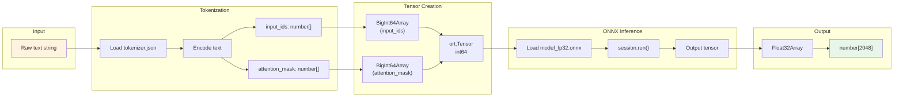

### Application State Flow

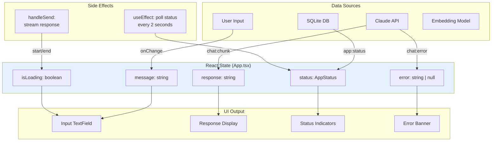

---

## 4. Entity-Relationship Diagram

### Complete Database Schema

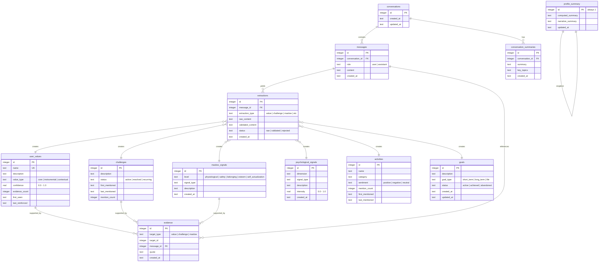

### Vector Database Schema

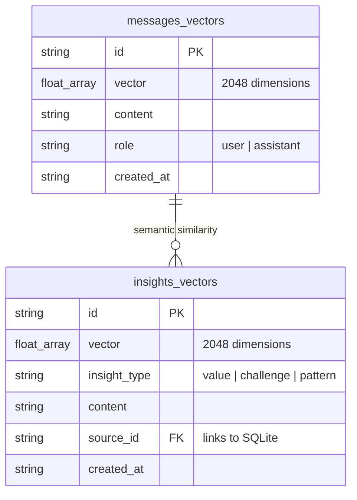

---

## 5. Sequence Diagrams

### Application Startup Sequence

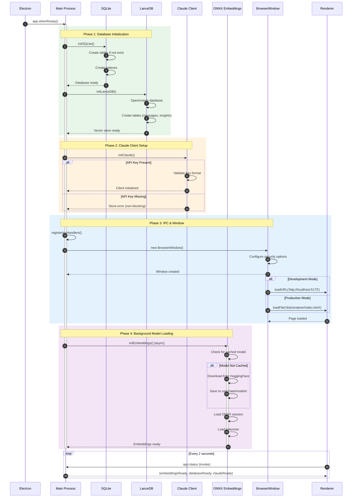

### Chat Streaming Sequence

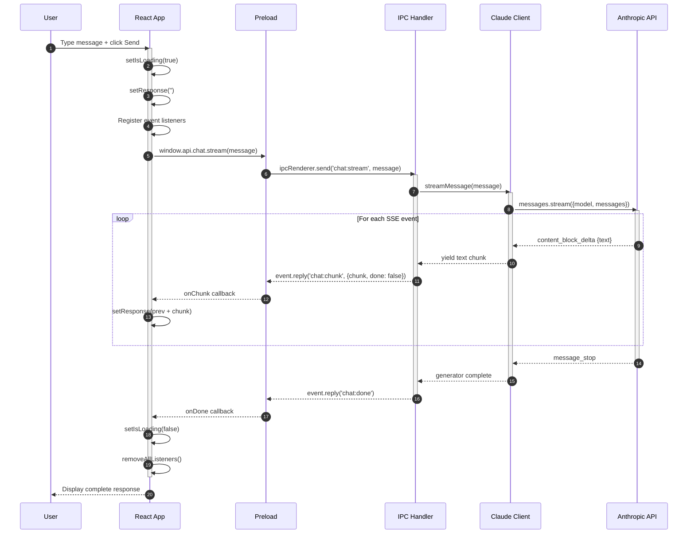

### Embedding and Vector Search Sequence

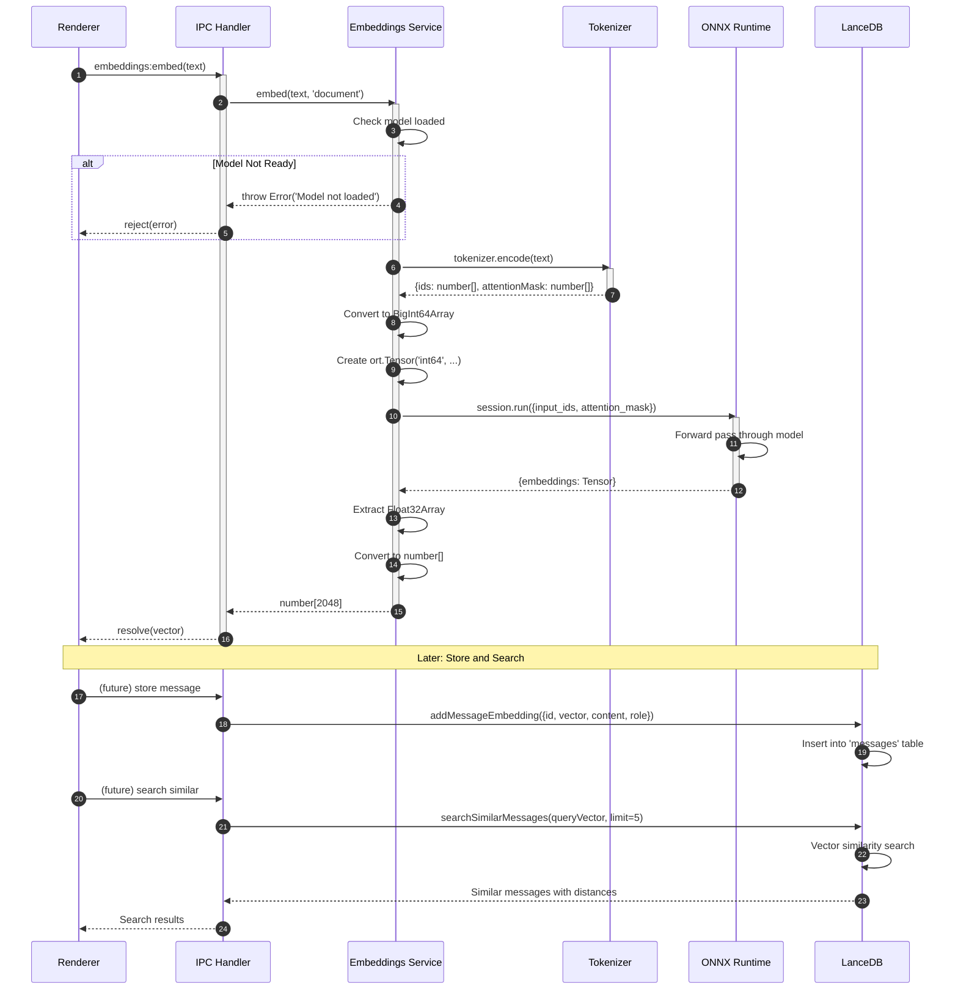

### Profile Loading Sequence

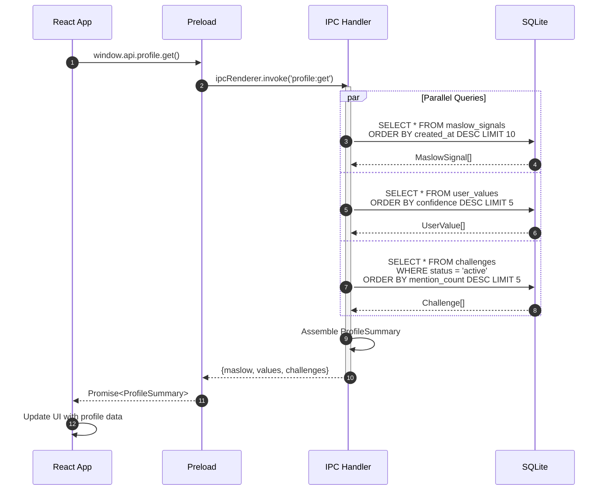

### Error Handling Sequence

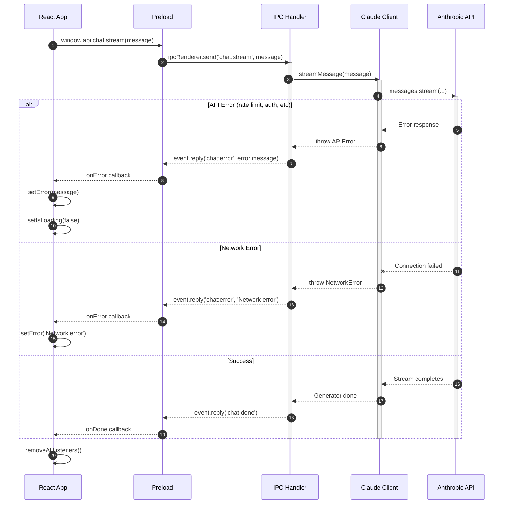

---

## Summary

These diagrams provide multiple perspectives on the architecture:

| Diagram Type | Purpose | Key Insights |
|--------------|---------|--------------|
| **C4 Context** | System boundaries | External dependencies on Anthropic API and HuggingFace |
| **C4 Container** | Process architecture | Three-process Electron model with dual databases |
| **C4 Component** | Internal structure | Service-oriented main process design |
| **Dependency Graph** | Module coupling | Clean layering, shared types at bottom |
| **Data Flow** | Runtime behavior | Streaming pattern for real-time responses |
| **ER Diagram** | Data model | Rich schema for psychological profiling |
| **Sequence Diagrams** | Temporal interactions | Async initialization, streaming, error handling |

### Key Architectural Decisions

1. **Context Isolation**: Renderer sandboxed from Node.js for security
2. **Dual Database**: SQLite for relations, LanceDB for vectors
3. **Local Embeddings**: Privacy-preserving on-device inference
4. **Streaming IPC**: Real-time response display via event pattern
5. **Non-blocking Init**: App opens before embeddings fully loaded

---

## Troubleshooting & Gotchas

### Common Issues

| Problem | Cause | Solution |
|---------|-------|----------|
| `Cannot find module './foo'` in main | Missing `.js` extension | Add `.js` to import: `import { x } from './foo.js'` |
| Preload script not loading | CommonJS/ESM mismatch | Ensure `dist/preload/package.json` has `"type": "commonjs"` |
| `window.api` is undefined | Preload didn't run | Check `webPreferences.preload` path in BrowserWindow |
| Native module errors | Electron ABI mismatch | Run `npm run rebuild` or `electron-rebuild` |
| Database locked | Multiple processes | Close other Electron instances |
| Embeddings not ready | Model still downloading | Check `window.api.embeddings.isReady()` before using |
| Tests timeout | Electron startup slow | Increase timeout in playwright.config.ts |

### Module System Cheatsheet

```
src/main/*.ts      → compiles to → dist/main/*.js      (ESM)
src/preload/*.ts   → compiles to → dist/preload/*.js   (CommonJS)
src/renderer/*.tsx → bundles to  → dist/renderer/      (Vite/ESM)
```

**Why two module systems?**
- Main process: ESM for modern Node.js features (`import.meta.url`)
- Preload: CommonJS required by Electron's context bridge
- Renderer: Vite bundles everything, module system doesn't matter

### TypeScript Config Files

| Config | Target | Module | Output |
|--------|--------|--------|--------|
| `tsconfig.json` | Base config | - | - |
| `tsconfig.main.json` | Main + shared | ESNext | `dist/main/` |
| `tsconfig.preload.json` | Preload + shared | CommonJS | `dist/preload/` |

### Build Order

```
1. tsc -p tsconfig.main.json       # Compile main process
2. tsc -p tsconfig.preload.json    # Compile preload
3. Write dist/preload/package.json # Force CommonJS
4. vite build                       # Bundle renderer
5. electron-builder                 # Package app
```

### IPC Debugging

**Main process** - Add logging:
```typescript
ipcMain.on('chat:stream', (event, msg) => {
  console.log('[IPC] chat:stream received:', msg);
  // ...
});
```

**Renderer** - Check DevTools console:
```typescript
console.log('window.api:', window.api);
console.log('API methods:', Object.keys(window.api.chat));
```

### Database Debugging

**SQLite** - Direct query in main process:
```typescript
import { getDb } from './db/sqlite.js';
const db = getDb();
console.log(db.prepare('SELECT * FROM messages').all());
```

**LanceDB** - Check tables:
```typescript
import { getDb } from './db/lancedb.js';
const db = await getDb();
console.log(await db.tableNames());
```

### Test Debugging

```bash
# Run single test with headed browser
npx playwright test tests/app-launch.spec.ts --headed --debug

# See Playwright trace
npx playwright show-trace test-results/*/trace.zip
```

### File Locations Quick Reference

```
Project Root
├── src/
│   ├── main/           # Main process (Node.js)
│   │   ├── index.ts    # Entry point
│   │   ├── ipc.ts      # IPC handlers
│   │   ├── claude.ts   # AI client
│   │   ├── embeddings.ts # ONNX inference
│   │   └── db/
│   │       ├── sqlite.ts  # Relational DB
│   │       └── lancedb.ts # Vector DB
│   ├── preload/        # Context bridge
│   │   └── index.ts
│   ├── renderer/       # React UI
│   │   ├── App.tsx
│   │   ├── main.tsx
│   │   └── index.html
│   └── shared/         # Shared types
│       └── types.ts
├── tests/              # Playwright tests
├── dist/               # Compiled output
├── release/            # Packaged app
└── docs/               # Documentation
    └── prd/            # Product requirements
```
